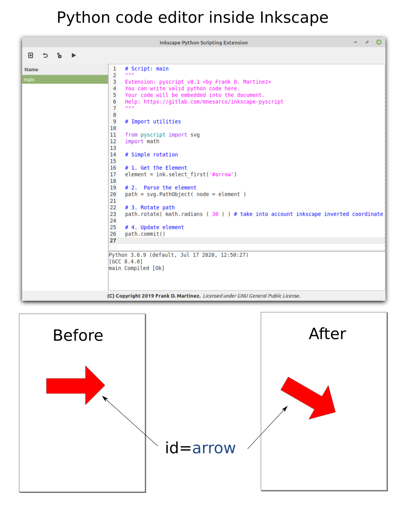

# Inkscape Python Scripting Extension

This is a very work in progress project to add general purpose python scripting capabilities to Inkscape.

## Documentation

*TODO: Write good docs*

Look at pyscript_samples/ to see how it works. 

## Install

*Requires Inkscape 1.0+, Python 3.5+, Gtk 3.x*

Copy all files and folders inside you inkscape extensions dir, in my environment (Mint 18 + Inskacape 1.0 + Python 3.5) there are two possible places:

 - $HOME/.config/inkscape/extensions/
 - /usr/share/inkscape/extensions/

Has been tested only on Linux Mint 19.2

## Try

The extension will appear in extensions menu inside Inkscape:

* Extensions
    * Python Scripting
        * Code Editor (Will start the editor to write/edit code)
        * Run and Update (Will run your code without opening the editor)

